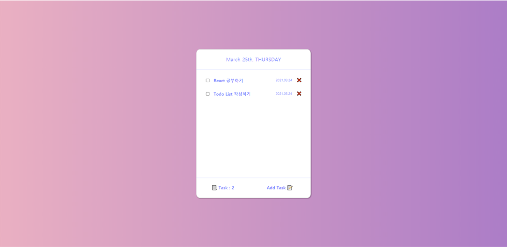
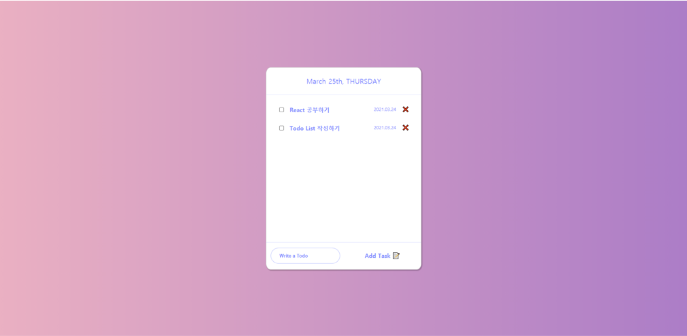

# souTodo(ver. React)

### ※ [**📋** souTodo](https://souvenir718.github.io/souTodo/) **리액트 버전**으로 업그레이드!

## 💻 실행화면

### 🎡 메인화면

 

### 🎡 Add Task를 눌렀을 때

 

## 🎯 프로젝트 소개

**"souTodo(ver.React)는 기존의 JS로 구성된 souTodo를 `React`를 활용하여 변경하였습니다!"**

`souTodo(ver.React)`는 `React`를 사용하여 제작한 웹 어플리케이션입니다.

상단부에는 오늘의 날짜를 볼 수 있고 하단부에는 해야한 일 `Todo`의 수를 확인 하고 새로운 `Todo`를 입력할 수 있습니다.

중간 부분은 자신이 입력한 `Todo`를 날짜와 함께 확인할 수 있고 `check`버튼을 이용해 완료한 일을 체크하거나 삭제할 수 있습니다.

입력한 `Todo`의 정보는 `Local Storage`에 저장이 되며 전체적인 상태관리는 `Redux toolkit`을 사용하여 관리하였습니다. 😎

